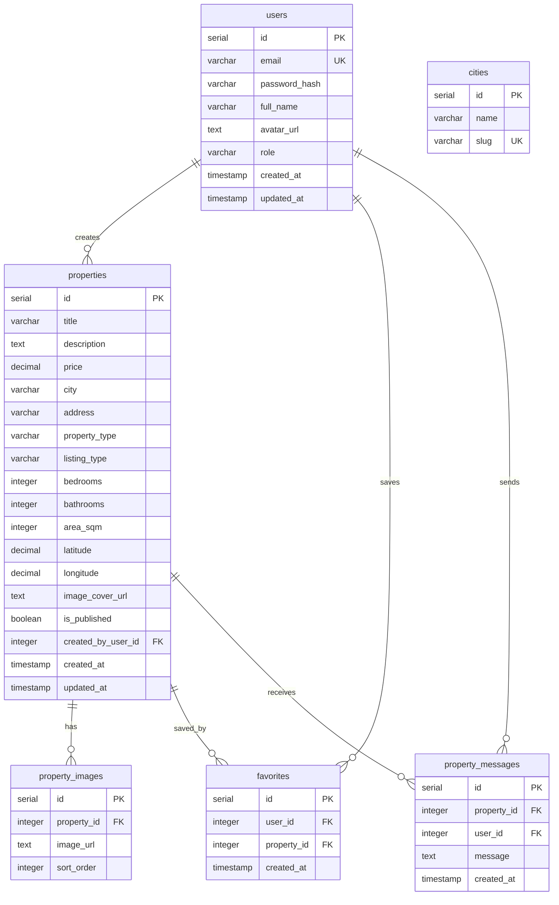

# Estately Database Schema

This document explains the Estately production database schema, relationships, and scalability strategy. The schema is implemented with Drizzle ORM and stored in `estately-web/src/db/schema`.

## Overview

Estately uses Neon PostgreSQL as the primary database. Drizzle ORM defines the schema in TypeScript, and Drizzle migrations in `estately-web/src/drizzle` keep the database structure reproducible across environments.

Main production tables:

- `users`
- `properties`
- `property_images`
- `favorites`
- `property_messages`
- `cities`

## Entity Relationship Diagram



## Data Flow

1. A user registers and is stored in `users`.
2. Authenticated users can create property listings in `properties`.
3. Property image URLs are stored in `property_images`, while the actual files live in Cloudflare R2.
4. Users save listings through `favorites`.
5. Users send inquiries through `property_messages`.
6. Public browsing, mobile search, favorites, dashboards, and admin moderation all read from these tables through Drizzle queries.

## Tables

### `users`

**Purpose:** Stores all registered Estately accounts.

**Primary key:** `id`

**Important fields:**

- `email`: unique login email.
- `password_hash`: bcrypt password hash.
- `full_name`: display name.
- `avatar_url`: optional profile image URL.
- `role`: account role, typically `user` or `admin`.
- `created_at`, `updated_at`: account timestamps.

**Foreign keys:** None.

**Relationships:**

- One user creates many `properties`.
- One user creates many `favorites`.
- One user sends many `property_messages`.

**Example:**

```text
id: 18
email: john@gmail.com
fullName: John Smith
role: user
createdAt: 2026-05-23T10:00:00.000Z
```

### `properties`

**Purpose:** Stores property listings shown in public browsing, search, mobile results, user dashboards, and admin moderation.

**Primary key:** `id`

**Important fields:**

- `title`: listing headline.
- `description`: listing description.
- `price`: sale or rental price.
- `city`: property city.
- `address`: street or area address.
- `property_type`: `apartment`, `house`, `villa`, `office`, or `land`.
- `listing_type`: `sale` or `rent`.
- `bedrooms`, `bathrooms`, `area_sqm`: listing facts.
- `latitude`, `longitude`: coordinates for map/search testing.
- `image_cover_url`: primary listing image URL.
- `is_published`: controls public visibility.
- `created_by_user_id`: owner/creator.
- `created_at`, `updated_at`: listing timestamps.

**Foreign keys:**

- `created_by_user_id` references `users.id` with cascade delete.

**Relationships:**

- One property belongs to one creator in `users`.
- One property has many `property_images`.
- One property can be saved many times through `favorites`.
- One property can receive many `property_messages`.

**Example:**

```text
id: 101
title: Modern Apartment in Sofia Center
price: 250000.00
city: Sofia
address: 123 Main Street, Sofia
propertyType: apartment
listingType: sale
bedrooms: 2
bathrooms: 1
areaSqm: 85
latitude: 42.6977000
longitude: 23.3219000
isPublished: true
createdByUserId: 18
```

### `property_images`

**Purpose:** Stores additional images for property detail galleries.

**Primary key:** `id`

**Important fields:**

- `property_id`: parent property.
- `image_url`: public image URL.
- `sort_order`: display order in galleries.

**Foreign keys:**

- `property_id` references `properties.id` with cascade delete.

**Relationships:**

- Many images belong to one property.

**Example:**

```text
id: 44
propertyId: 101
imageUrl: https://example-cdn.com/properties/101/living-room.jpg
sortOrder: 0
```

### `favorites`

**Purpose:** Stores saved properties for authenticated users.

**Primary key:** `id`

**Important fields:**

- `user_id`: user who saved the listing.
- `property_id`: saved property.
- `created_at`: when the property was saved.

**Foreign keys:**

- `user_id` references `users.id` with cascade delete.
- `property_id` references `properties.id` with cascade delete.

**Constraints:**

- `unique_user_property_favorite` prevents a user from saving the same property more than once.

**Relationships:**

- Many favorites belong to one user.
- Many favorites belong to one property.

**Example:**

```text
id: 300
userId: 18
propertyId: 101
createdAt: 2026-05-23T10:15:00.000Z
```

### `property_messages`

**Purpose:** Stores user inquiry messages about properties.

**Primary key:** `id`

**Important fields:**

- `property_id`: property being asked about.
- `user_id`: user who sent the inquiry.
- `message`: inquiry text.
- `created_at`: timestamp.

**Foreign keys:**

- `property_id` references `properties.id` with cascade delete.
- `user_id` references `users.id` with cascade delete.

**Relationships:**

- Many messages belong to one user.
- Many messages belong to one property.

**Example:**

```text
id: 55
propertyId: 101
userId: 18
message: I am interested in this property. Can we schedule a viewing?
createdAt: 2026-05-23T10:30:00.000Z
```

### `cities`

**Purpose:** Stores supported city metadata for seed data and city-based browsing.

**Primary key:** `id`

**Important fields:**

- `name`: city display name.
- `slug`: unique URL-safe city identifier.

**Foreign keys:** None.

**Relationships:**

- `properties.city` stores the city name as listing data. There is currently no direct foreign key from `properties.city` to `cities.name`.

**Example:**

```text
id: 1
name: Sofia
slug: sofia
```

## Relationship Summary

```text
users -> properties
  A user can create many property listings.

properties -> property_images
  A property can have many gallery images.

users -> favorites
  A user can save many properties.

favorites -> properties
  Each favorite points to one saved property.

users -> property_messages
  A user can send many inquiry messages.

property_messages -> properties
  Each inquiry belongs to one property.
```

## Drizzle And Migration Notes

- Schema definitions live in `estately-web/src/db/schema`.
- Migrations live in `estately-web/src/drizzle`.
- The application uses Drizzle ORM for type-safe database reads and writes.
- Neon PostgreSQL is the hosted database provider.
- Foreign keys use cascade deletes where dependent records should be removed with their parent.

Useful commands:

```bash
npm run --workspace=estately-web db:generate
npm run --workspace=estately-web db:migrate
npm run --workspace=estately-web db:seed
npm run --workspace=estately-web db:verify
```

## Indexes

Important indexes include:

### Users

- `users_role_idx`
- `users_created_at_idx`
- `users_full_name_idx`

### Properties

- `properties_city_idx`
- `properties_property_type_idx`
- `properties_listing_type_idx`
- `properties_price_idx`
- `properties_bedrooms_idx`
- `properties_bathrooms_idx`
- `properties_is_published_idx`
- `properties_created_by_user_id_idx`
- `properties_created_at_idx`
- `properties_area_sqm_idx`

### Favorites

- `favorites_property_id_idx`
- `favorites_created_at_idx`
- `unique_user_property_favorite`

### Property Messages

- `property_messages_property_id_idx`
- `property_messages_user_id_idx`
- `property_messages_created_at_idx`

## Scalability Strategy

The database has been prepared for project-scale review with:

- **10,000 seeded properties** for realistic browsing and filtering tests.
- Server-side pagination for public and mobile property lists.
- Database-level filtering instead of in-memory filtering.
- Indexes on common filters: city, property type, listing type, price, bedrooms, bathrooms, published status, area, and created date.
- Coordinates on properties for map and location-oriented testing.
- A load-test script for repeatable performance data generation.

Verified performance snapshot:

```text
properties count: 10,000
mobile paginated query: ~48ms
city filter query: ~46ms
property type filter query: ~47ms
```

The key performance pattern is to keep large result sets paginated and to push search and filter conditions into PostgreSQL through Drizzle queries.
